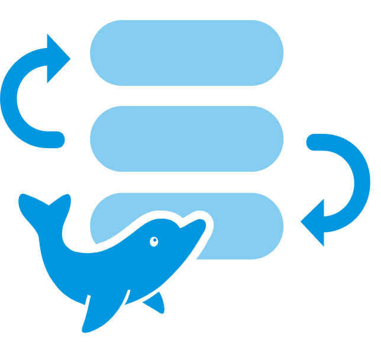

# awesome-dolphinscheduler 

该仓库主要是`Apache DolphinScheduler`官网资料的补充，收集各种相关的学习资料。
主要包含：

+ 二次开发详细指导
+ 源码解读
+ 相关资料/blog的汇总

### **:tada:** 最有效的资料

学习一个开源系统，什么资料最有效？**官网文档！官方文档！官网文档！**
因为官方文档是社区团队共同编辑和检视的，它所表达的信息将是最准确的、最权威的，其他网上的文档只能作为补充而不能替代官方文档的作用。并且`DolphinScheduler`的官网文档比较全面，部署、任务说明、框架设计等都有比较详细的描述，所以学习`Apache DolphinScheduler`之前，请先确保自己已经看完了官网文档：

:point_right: [Apache DolphinScheduler 官方文档](https://dolphinscheduler.apache.org/zh-cn/docs/latest/user_doc/about/introduction.html)

### **:art:** 源码分析

